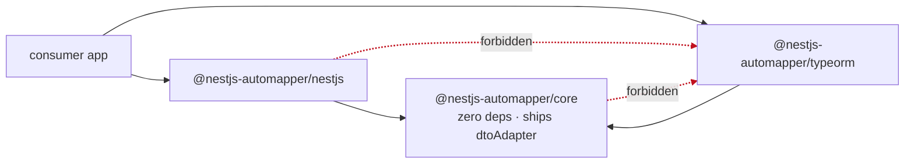

# Architecture Spine — @nestjs-automapper 2.0

## Design Paradigm

**A compiler.** Not a metaphor — the structure is literal, and naming it fixes most of what follows.

| Compiler role | Here | Namespace |
| --- | --- | --- |
| Front-end / parser | Schema adapters normalise a source of truth into `TypeDescriptor` | `core/descriptor/`, `typeorm` |
| Lowering | The planner resolves descriptors + config into the IR | `core/plan/` |
| **IR** | `MappingPlan` — one `ResolutionNode` per destination field | `core/plan/` |
| Back-ends | Codegen, projector, explainer, plan validator, OpenAPI emitter | `core/emit/`, `core/project/`, `core/diagnose/`, `core/schema/` |

Properties inherited rather than argued: one IR, dataflow strictly one way, back-ends never talk to front-ends, every consumer of a mapping reads the same artifact.

Ports-and-adapters governs the schema boundary: `SchemaAdapter` is the port, `typeorm` the first adapter, `core` never knows an ORM exists.

**The governing principle, learned the hard way in review:** an AD that denies a unit some information must name where that information comes from instead. AD-1 without AD-14 and AD-12 made three capabilities unimplementable.

## Invariants & Rules

### AD-1 — One-way dataflow, with the plan carrying what it denies

- **Binds:** all
- **Prevents:** a back-end reading adapter metadata directly, creating a second source of truth about a mapping
- **Rule:** Adapters produce `TypeDescriptor` only. The planner is the sole consumer of descriptors. Back-ends consume `MappingPlan` only and never import an adapter or a descriptor type. **Compensating clause:** because back-ends are denied descriptors, the planner denormalises onto each node every descriptor-derived fact any back-end needs — declared type, nullability, enum values, provenance flags, producing adapter name, and the resolved child plan. A back-end needing a fact the node lacks is a planner defect, never a licence to reach across.

### AD-2 — The IR node set is closed, and its recursion is explicit

- **Binds:** CAP-3, CAP-4, CAP-5, CAP-6, CAP-7, CAP-8, CAP-9
- **Prevents:** back-ends diverging on node semantics; a back-end silently dropping fields while still passing an exhaustiveness check
- **Rule:** `ResolutionNode` is a closed discriminated union on `kind`. Every back-end switches exhaustively with a `never` check and no `default` arm. Adding a kind is a breaking `core` change and updates every back-end in the same commit.
  - Recursion is explicit: any kind carrying a child exposes it through one well-known accessor, `children(node)`, defined once in `core/plan/`. Back-ends are folds over `children()`, not flat switches.
  - Exhaustiveness over `kind` is necessary and **not sufficient**. Each back-end ships a leaf-coverage test asserting its output covers every destination field with no `{}`, `undefined`, or no-op result. `case 'gated': return {}` passes `never` and drops a field; the coverage test is what catches it.
  - A gate is a **wrapper node** (`kind: 'gated'`, carrying `child`), never a flag on another node, so nested gates have one representation.
  - Every declared destination field has exactly one top-level node — including ignored ones, which are `kind: 'ignore'`. A deliberate ignore must be distinguishable from a typo.

### AD-3 — Generated code never interpolates untrusted strings

- **Binds:** codegen, CAP-1, CAP-5
- **Prevents:** syntax breakage and code injection via column or field names, which originate in ORM metadata and user config
- **Rule:** Property access in generated source uses bracket notation with `JSON.stringify`-ed keys. Every identifier in generated source comes from a fixed emitter-controlled alphabet (`s`, `d`, `v0…vN`). Resolver functions are passed as closure arguments and never stringified into the body.

### AD-4 — Registry keys are class identity, and the registry is enumerable

- **Binds:** all
- **Prevents:** the v1 defect where keys built from `class.name` collided under minification; and CAP-4's did-you-mean being impossible to compute
- **Rule:** The mapping registry keys on the constructor reference and **must be enumerable** — a `Map`, not a `WeakMap` — because CAP-4 requires listing the destination types registered for a source. Registrations live as long as the mapper by design. `WeakMap` is reserved for per-operation identity tracking (AD-7), where non-enumerability is correct. `.name` appears only in rendered error text.

### AD-5 — One error taxonomy, payload closed per code

- **Binds:** CAP-3, CAP-4
- **Prevents:** each package inventing its own error shape; a payload too thin to carry what CAP-4 promises
- **Rule:** All errors extend `AutomapperError` in `core` with a machine-readable `code` and a payload declared in one place (`core/diagnose/error-codes.ts`) as a discriminated union on `code`. **Open by code, closed per code:** adding a code adds a payload shape; no package invents a field for an existing code.
  - Common fields: `sourceType?`, `destType?`, `field?`, `adapter?`, and `origin?: { file, line }`.
  - Candidate lists are never one polymorphic field: `typeCandidates?: readonly ClassLike[]` and `nameCandidates?: readonly string[]` are separate.
  - `origin` is captured by `core` at declaration time — `createMap`, `Pick`, and `extend` each capture one stack frame above the library boundary. This is what makes CAP-4's "where to fix it" possible.
  - Message rendering is a `core` function. No host package assembles or appends message text; adapters never throw a raw `Error`.

### AD-6 — Dependency direction

- **Binds:** all packages
- **Prevents:** adapter-to-adapter coupling; `core` reaching into an ORM
- **Rule:** `core` imports nothing. Adapter and integration packages import `core` only. No adapter imports another adapter. `nestjs` must not import `typeorm`. Enforced by lint rule and pnpm's strict resolution. The built-in `dtoAdapter` (AD-17) lives in `core` and is exempt, as it imports nothing.



### AD-7 — Registration state is sealed; operation state is scoped

- **Binds:** CAP-7
- **Prevents:** cross-request leakage; the v1 cache-staleness defect; and the earlier over-broad rule that would have blocked registration itself
- **Rule:** Two state classes, and only two. **Registration state** (registry, sealed plans, compiled functions) is mutable during Declare, frozen at Seal, read-only during Serve (AD-16). **Operation state** (identity map, ancestor chain, resolver memo) lives on a context created per top-level `map`/`projectionFor` call and discarded on return. Nothing else is mutable, and no module-level mutable state exists.
  - Cycle detection tracks the **ancestor chain**, never a global visited set — a node reachable by two independent paths is shared data and must still map.
  - A true back-edge on a non-optional destination field fails at Seal, naming the cycle path. On an optional field the default is omit; reference-marker mode is opt-in per map. A depth ceiling, exported once from `core`, backstops both mapping and projection.

### AD-8 — Failure moves left, and only one unit converts a diagnostic into a failure

- **Binds:** CAP-3, CAP-4, CAP-10
- **Prevents:** divergent choices about where a rule is enforced, and about who ends the process
- **Rule:** The enforcement ladder is: **type system → Seal → Serve → never at request time.** A rule is enforced at the highest rung it can be expressed at; "can be expressed" means a reviewer can point at the mechanism, not a matter of taste. A rule the type system carries must not ship as a runtime check only.
  - AD-8 also fixes **who converts a diagnostic into a failure.** `core` produces diagnostics and never decides process lifetime. Exactly two units convert: `AutomapperModule.onModuleInit` when `validate: true`, and the `automapper check` CLI. Any other unit throwing on a diagnostic is a violation.
  - Missing context is a Seal-time concern, not a request-time one: a plan carrying gated nodes is marked `requiresContext`, and the absence of a context provider is caught at Seal. There is never a fallback context.

### AD-9 — Async is a plan property, computed as a fixpoint

- **Binds:** CAP-2
- **Prevents:** a sync parent with an async child — the floating promise this AD exists to stop
- **Rule:** `plan.isAsync` is the **least fixpoint** of the disjunction over (a) the plan's own nodes and (b) the plans of every `nested`/`collection` child, computed over the whole strongly-connected plan graph. It is computed as a distinct pass after the transitive closure of nested pairs is registered (AD-16), never during the lowering of a single pair. A cyclic plan group shares one value. Immutable once the closure pass completes; a later registration re-runs its own SCC only and must never flip an already-emitted pair from sync to async — that is `PLAN_ASYNC_ESCALATION` at registration.
  - Codegen emits either a sync or an async function for a pair, never both. The sync entry point is type-rejected for an async-branded destination. Where the type system provably cannot compute the brand — circularly-referencing DTO pairs — the planner emits `PLAN_ASYNC_UNBRANDED` at Seal, which AD-8's ladder permits because the type rung is unreachable.

### AD-10 — Projection derives from the plan, and its selection vocabulary is explicit

- **Binds:** CAP-5
- **Prevents:** projector and codegen disagreeing about which columns a field needs; the empty-array ambiguity; and the union-across-contexts over-fetch the SPEC forbids
- **Rule:** The projector walks `MappingPlan` and never inspects the destination class, the registry, or adapter metadata. `core` emits a neutral `FieldSelection`; only adapters translate to a native shape.
  - `FieldSelection` is `{ fields: readonly string[]; relations: Readonly<Record<string, FieldSelection>>; all?: true }`. `fields: []` means **exactly none**; `all: true` is the explicit escape hatch and propagates to no other level. Presence of a relation key means the join is required.
  - Merge is a published `core` function, `mergeSelection`: `fields` set-union, `relations` deep recursive merge by name, `all: true` absorbing that level's `fields`. Nobody re-implements it.
  - `nested`/`collection` nodes declare `deps` covering **only** the relation root plus values the node itself reads. The child's contribution comes from recursing into `node.childPlan`, linked by value in the sealed closure — so the projector never touches the registry and AD-1 holds. Deps are never flattened across a relation boundary.
  - Projection obeys the same cycle rule as mapping (AD-7), with its own per-call context.
  - **`projectionFor` throws when the plan carries gated nodes and no context is supplied.** Projecting the union of contexts is forbidden: it silently over-fetches, which is precisely what CAP-5 exists to prevent and which no review would catch.

### AD-11 — Toolchain split, and the no-plugin guarantee

- **Binds:** all packages
- **Prevents:** shipping artifacts consumers cannot build; anyone reintroducing a transformer-plugin dependency
- **Rule:** Emit with the TypeScript 6.x line, consumed via the npm alias `@typescript/typescript6` — the compiler API is required for `.d.ts` generation, for `@nx/js:tsc` (itself an API consumer), and for consumers running `nest build`. CI additionally type-checks the published `.d.ts` under TypeScript 7.x. **The library must never require a TypeScript transformer plugin of its consumers.**
- **Expiry:** TypeScript 7.0 ships no compiler API, which breaks `nest build`, the `@nestjs/swagger` and GraphQL CLI plugins, `ts-jest`, `ts-loader`, and type-aware ESLint. This is **temporary** — the API is expected to return in 7.1, provisionally around October 2026, with no confirmed date. **Revisit trigger:** the first stable 7.x release exposing a compiler API; at that point the alias and the split collapse to a single line.

The no-plugin rule is an **ergonomic edge, not a moat.** `@automapper/classes` does require a transformer plugin that is an API consumer, and its upstream "typescript 7" PR closed unmerged — but under the same alias setup this project itself uses, that plugin still works, and no TS-7-only NestJS toolchain exists to be advantaged on. Requiring no plugin removes setup steps and one class of silent failure; it does not lock anyone out.

### AD-12 — Paths are structured before they enter the IR

- **Binds:** CAP-5, CAP-10, CAP-2
- **Prevents:** a dotted string being read as relation traversal by one unit and JSON-column interior by another — with AD-1 denying the projector the descriptor that would disambiguate it
- **Rule:** No plan node carries a dotted string. The planner resolves every user path against the source descriptor at plan build and lowers it to `PathSegment[]`:
  `{ kind: 'field'; name } | { kind: 'relation'; name; target } | { kind: 'index' } | { kind: 'json'; name; interior }`.
  A `'json'` segment is terminal for projection — the projector selects `name` and never descends into `interior`. Resolution happens exactly once and is the planner's exclusive responsibility. Back-ends never parse, split, or join a path. The dotted string survives only in error render fields and `MappingExplanation`.

### AD-13 — A plan is total, or it is a report

- **Binds:** CAP-3, CAP-4
- **Prevents:** throw-on-first-defect making CAP-4's aggregate report unsatisfiable; or an `'unresolved'` node kind forcing every back-end to carry an arm for broken input
- **Rule:** `buildPlan` never throws for a **mapping-content** defect. It returns `{ ok: true; plan } | { ok: false; diagnostics }`. `MappingPlan` is **total** by construction: every destination field has a resolvable node, and there is no `'unresolved'` kind — so back-ends never meet one. Only the plan validator and boot sweep consume the failure branch. `buildPlan` still throws immediately for **structural** defects that make planning impossible: no adapter supports the source, or the destination is not a runtime-real class.

### AD-14 — Descriptors are exhaustive; policy belongs to the planner alone

- **Binds:** CAP-5, CAP-8
- **Prevents:** two owners of "is this field mappable" — an adapter filtering `password` out so it can never be mapped, or not filtering it so it leaks
- **Rule:** `describe()` returns every field and relation the schema declares, with no filtering, ordering, or policy. Filtering is exclusively the planner's, driven by provenance flags. `FieldMeta` carries the complete provenance set — `isPrimary`, `isGenerated`, `isCreateDate`, `isUpdateDate`, `isDeleteDate`, `isVersion`, `isDiscriminator`, `hasDefault`, `isSelectByDefault` — and **every flag is required, not optional**, so "unknown" can never be read as "no". Two published policy tables live in `core`:
  - **Read:** `isSelectByDefault === false` excludes a field from `auto()` and implicit `Pick` expansion; naming it explicitly is permitted.
  - **Write (CAP-8 drop list):** `isPrimary || isGenerated || isCreateDate || isUpdateDate || isDeleteDate || isVersion || isDiscriminator` are dropped. `isSelectByDefault === false` is **not** a drop reason — that is the `password` case and must survive.
  - A user-declared write DTO containing a drop-list field is a **rejection at Seal**, never a silent exclusion. Otherwise "excluded automatically" has no owner and the validator sees no defect either way.
  - Changing a table is a `core` change. No adapter encodes policy.

### AD-15 — One name space in the IR

- **Binds:** CAP-5, CAP-4
- **Prevents:** the projector emitting property names while an adapter expects native column names; and two owners of naming-convention conversion
- **Rule:** Every string identifying a member anywhere in `MappingPlan`, `FieldSelection`, `PathSegment`, or `MappingExplanation` is a **property name as declared on the class** — never a native/database name. `nativeName` exists only so adapters can translate a property-keyed selection into a native shape, and so `core/diagnose` can offer it as a did-you-mean candidate. It never enters a plan node or a selection.
  - **Naming-convention conversion has exactly one owner: the adapter.** `FieldMeta.name` is the class property name verbatim. The planner performs no conversion; `auto()` matches on exact property-name equality. Fuzzy matching exists only in diagnostics, over `name ∪ nativeName`, and never affects resolution.

### AD-16 — One plan lifecycle: declare, seal, serve

- **Binds:** CAP-3, CAP-6, all packages
- **Prevents:** three plausible plan-build moments; the boot sweep and the CI check enumerating different pair sets; `Pick` resolving a descriptor before the DataSource is initialised
- **Rule:** Exactly three phases, in order, and no unit builds a plan outside them.
  1. **Declare** — `createMap`, `Pick`, `extend`, `reverse` record configuration only. They resolve no descriptor and throw only for shape errors detectable without schema. `Pick(Entity, keys)` stores `(entityCtor, keys)` and resolves lazily; it is never a snapshot.
  2. **Seal** — one call, `mapper.seal()`, invoked by `AutomapperModule.onModuleInit` and by `automapper check`. Resolves descriptors, computes the transitive closure of nested pairs (**CAP-6 auto-registration happens here and nowhere else**), runs the `isAsync` fixpoint (AD-9), builds every plan, returns `PlanReport`. After Seal the registry is frozen; `use()` and `createMap()` throw `REGISTRY_SEALED`.
  3. **Serve** — `map`/`mapArray`/`projectionFor` read sealed artifacts only. Compiling a plan to a function may be lazy, but a lazily compiled function may not consult the registry for anything outside the sealed closure.
  - `validate` defaults to `true`. `validate: false` skips only the failure conversion, never the Seal. An unsealed mapper throws `REGISTRY_UNSEALED` on first `map`, so lazy first-call plan-building is unreachable and CAP-3 cannot be silently opted out of.
  - `automapper check` and `AutomapperModule` must enumerate the **same** pair set: the CLI boots the app's Nest context with a null transport rather than constructing a bare `Mapper`, and `forFeature` modules are eagerly instantiated during a check. A pair reachable only through a lazily-loaded module is reported `PAIR_UNSWEPT`, never silently skipped.

### AD-17 — Adapter arbitration is explicit and total

- **Binds:** CAP-1, CAP-5, CAP-8
- **Prevents:** two adapters both claiming a type with three equally compliant tie-breaks; and the zero-adapter case being unowned
- **Rule:** The adapter set is an **ordered list**. The first adapter whose `supports(type)` returns `true` describes it; a descriptor is never merged from two adapters. Adapters are identified by **instance identity**, never by `name` — `name` is display-only and duplicates are legal (multi-DataSource). `supports()` is a **pure, non-throwing predicate**: no I/O, and an adapter that cannot answer returns `false`. Order is the app's explicit responsibility — the `forRoot({ adapters })` array order is the total order, `forFeature` may add pairs but never adapters, and `use()` after Seal throws.
  - `core` ships a built-in terminal adapter, `dtoAdapter`, supporting any class produced by `Pick`/`extend` and describing it from the runtime field registry. Always last, imports nothing, exempt from AD-6.
  - If no adapter including `dtoAdapter` supports a type, the planner throws `NO_ADAPTER` at Seal, naming the type and every registered adapter's name and index.

### AD-18 — One null model

- **Binds:** CAP-7, CAP-9, CAP-1
- **Prevents:** "omit" being implemented as `delete` — which contradicts the spike finding that every declared key must be an own-property — and three different absences reaching the wire identically
- **Rule:** Every destination key declared by `Pick`/`extend` is an own-property of every mapped instance, always. "Omit" never means `delete` and never means unassigned. The three absence conditions have pinned encodings:

  | Condition | Value | OpenAPI |
  | --- | --- | --- |
  | Database null | `null` | `nullable: true`, property required |
  | Gate false (`visible()`) | `undefined` | not in `required` |
  | Cycle back-edge, omit mode | `undefined` | not in `required` |
  | Cycle back-edge, marker mode | marker object | marker schema as a `oneOf` branch |

  `undefined` never crosses the wire and `null` always does; that difference is the entire contract. The table lives in `core` and both codegen and the OpenAPI emitter compile against it.

### AD-19 — The DTO construction contract

- **Binds:** CAP-1, CAP-2, CAP-9, CAP-10
- **Prevents:** the keystone that carries four capabilities and the v1 regression fix being governed by nothing but a directory name
- **Rule:** `Pick` and `extend` return a **real runtime class**, and that class satisfies four properties, each with a test that fails when it is violated:
  1. It is a function with a `prototype` — the NestJS DI token requirement — and `instanceof` holds through composition.
  2. Its constructor **assigns every declared key**, so instances carry real own-properties. Omitting this reproduces the v1 defect in which a presence check against the destination was always false and every mapping silently produced an empty object. This is non-negotiable and is why AD-18 forbids `delete`.
  3. It exposes a runtime field registry equal to picked ∪ computed keys, and its resolvers with their declared deps are reachable at runtime.
  4. A derived field has **exactly one declaration site**: the resolver supplies both the static type and the runtime resolution. No construct may require a field to be named twice.
  - **The supported public form is a class declaration extending the expression** — `class ReadUserDto extends extend(Pick(User, [...]), {...}) {}` — matching Nest's `PickType` idiom. The `const X` + `type X = InstanceType<typeof X>` form is **forbidden**: the self-referential alias makes TypeScript break the cycle via the key parameter's constraint, silently readmitting every source field.
  - Three typing rules are load-bearing and were each a real defect before the compile-time suite caught them: `ClassLike`/`Instantiable` take `(...args: any[])`, never `never[]`, or `InstanceType` fails its own constraint and every DTO type degrades to `any`; `Pick`'s keys are a `const` tuple, not a per-element parameter, or inline calls fall back to `keyof T`; and `extend` infers its base via `InstanceType<TBase>`, not a positional `B`, or the intersection widens.
  - Enforcement is a compile-time assertion suite (`*.test-d.ts`) alongside the runtime specs, run on **both** the 6.x and 7.x lines. Positive claims use an `AssertEqual` helper; negatives use `@ts-expect-error`, which fails the build if a guardrail ever stops erroring. A vacuous pass is the failure mode this suite exists to prevent — runtime tests and human review both missed all three rules above.

### AD-20 — Packaging and consumer toolchain

- **Binds:** all packages
- **Prevents:** three packages diverging on module format, target, or class-field semantics at first build — and a consumer compiling the library into the v1 bug
- **Rule:** Every published package declares the same envelope, fixed here rather than per-package:
  - Dual ESM + CJS, with an explicit `exports` map and matching `types` per condition. No deep imports: every public entry point is named in `exports`.
  - `engines.node >= 22.13` — the floor set by Vitest 5; TypeORM 1.x requires only `>= 20.19`, so the higher bound governs.
  - Minimum consumer TypeScript is the 6.x line; `.d.ts` must additionally type-check under 7.x (AD-11).
  - **`useDefineForClassFields` must not change observable behaviour of `Pick`/`extend` output.** AD-19's constructor assignment is what makes this true, and a test compiles the DTO fixtures under both settings. This is the exact mechanism behind the v1 empty-object defect and is not left to consumer configuration.
  - `reflect-metadata` is a peer of the `nestjs` package only. `core` declares no dependencies of any kind, and CI asserts its `dependencies` and `peerDependencies` are both empty.
  - Peer ranges for `@nestjs/*` and `typeorm` are declared once, in a shared constant, and every package references it — a range may not drift per package.

## Consistency Conventions

| Concern | Convention |
| --- | --- |
| Naming — entities | `TypeDescriptor`, `FieldMeta`, `RelationMeta`, `MappingPlan`, `ResolutionNode`, `PathSegment`, `FieldSelection`. Singular, no `I` prefix. |
| Naming — files | kebab-case, one exported concept per file, role-suffixed: `*.plan.ts`, `*.emitter.ts`, `*.adapter.ts`, `*.error.ts` |
| Naming — packages | `@nestjs-automapper/<name>`; adapter packages named for the ORM alone |
| Member names | Property names everywhere in the IR; `nativeName` only for adapter translation and did-you-mean (AD-15) |
| Source paths | Dotted `Path<S>` at the API surface; `PathSegment[]` inside the IR (AD-12). `.` is the only separator, array elements use `.<n>`, and a property whose name contains `.` is not addressable in 2.0 — rejected at Seal with `PATH_UNADDRESSABLE`. |
| Ids & keys | Constructor reference (AD-4). Registry pair key is the tuple `(sourceCtor, destCtor)`, never a string. |
| Error shape | `AutomapperError` + `code` + payload closed per code; rendering centralised in `core` (AD-5) |
| Absence | One null model table (AD-18). `undefined` never crosses the wire; `null` always does. |
| State & mutation | Registration state sealed at Seal; operation state per-call (AD-7, AD-16) |
| Async | A plan is sync or async as a whole, by fixpoint (AD-9) |
| Validation direction | Value validation applies to the write path only. Entities read from the project's own database are never value-validated. |
| Tests | Vitest, colocated `*.spec.ts`. Every mechanically checkable AD gets a test that fails when it is violated — specifically AD-2 leaf coverage, AD-19's four properties, AD-20's dual-config compile, and AD-6's dependency assertions. |
| Generated code | Emitter-controlled identifiers; keys bracket-quoted via `JSON.stringify` (AD-3) |

## Stack

Verified live on the npm registry, 2026-09-08.

| Name | Version |
| --- | --- |
| TypeScript — emit, via alias `@typescript/typescript6` | 6.0.2 |
| TypeScript — additional check target | 7.0.2 |
| Nx | 23.2.0 |
| pnpm | 12.3.4 |
| Vitest | 5.0.0 |
| Node (floor) | 22.13 |
| `@nestjs/common` · `@nestjs/core` · `@nestjs/swagger` · `@nestjs/testing` (peer) | 12.0.1 |
| `typeorm` (peer) | 1.1.1 |
| `reflect-metadata` (peer, `nestjs` only) | 0.2.2 |

Build executor is `@nx/js:tsc`, which is itself a TypeScript compiler-API consumer — this is why AD-11's line choice binds the build, not only consumers. `tsup` was rejected: last published 2025-11-12 and its README now declares it unmaintained in favour of `tsdown`; Nx 23 supplies maintained executors regardless.

## Structural Seed

```text
custom-nestjs-automapper/
  packages/
    core/src/
      descriptor/    # TypeDescriptor, FieldMeta, RelationMeta, SchemaAdapter port,
                     #   adapter-registry (AD-17), built-in dtoAdapter
      dto/           # Pick, extend, resolvers, Path<S>  (AD-19)
      plan/          # MappingPlan, ResolutionNode, children(), planner, PathSegment
                     #   lowering (AD-12), seal + closure + isAsync fixpoint (AD-9, AD-16)
      emit/          # codegen back-end + generated-source builder (AD-3)
      project/       # projector back-end, FieldSelection, mergeSelection (AD-10)
      diagnose/      # explainer, error-codes.ts, AutomapperError taxonomy (AD-5)
      schema/        # OpenAPI back-end (CAP-9)
      runtime/       # operation context: identity map, ancestor chain, memo (AD-7)
      policy/        # read + write policy tables, null model table (AD-14, AD-18)
    typeorm/src/     # adapter: describe() + toNativeProjection()
    nestjs/src/      # module, ALS context, @MapTo, @Projection, seal on init,
                     #   automapper-check CLI (AD-16)
  docs/
```

The `core` back-ends are siblings: each depends on `plan/`, none on each other, none on `descriptor/` (AD-1, AD-2).

## Capability → Architecture Map

| Capability | Lives in | Governed by |
| --- | --- | --- |
| CAP-1 DTO without restating the entity | `core/dto`, `core/descriptor`, `typeorm` | AD-19, AD-17, AD-11, AD-20 |
| CAP-2 Derived field declared once | `core/dto`, `core/plan` | AD-19, AD-9, AD-12 |
| CAP-3 Broken mappings fail at boot | `core/plan`, `nestjs` | AD-16, AD-13, AD-8 |
| CAP-4 Errors diagnosable from text | `core/diagnose` | AD-5, AD-4, AD-13 |
| CAP-5 Fetch only what the DTO uses | `core/project`, `typeorm` | AD-10, AD-12, AD-15, AD-14 |
| CAP-6 Nested pairs auto-registered | `core/plan` | AD-16, AD-2, AD-4 |
| CAP-7 Cyclic and shared graphs | `core/runtime` | AD-7, AD-18 |
| CAP-8 Reverse mapping, scalars | `core/plan`, `core/policy` | AD-14, AD-1 |
| CAP-9 OpenAPI from the descriptor | `core/schema` | AD-1, AD-2, AD-18 |
| CAP-10 Dep typos are compile errors | `core/dto` | AD-19, AD-8, AD-12 |

## Non-goals inherited from the SPEC

Restated because an implementer reads this file, not only the SPEC, and each rules something out here.

- **No query building.** Nothing in `core/project` may issue or compose SQL. It emits a selection; the caller runs the query.
- **No validation framework.** No per-property validation system. `class-validator` may be consumed as a metadata source only, through the `SchemaAdapter` port.
- **No cross-operation result caching.** Forbidden by AD-7.
- **No Prisma, Mongoose, or Drizzle adapter in 2.0.** The port must nonetheless stay general enough that one is additive.
- **No browser or CSP-restricted runtime.** `new Function` is assumed available.
- **No v1 migration path.**

SHOULD-tier work must remain reachable: implicit registration is permitted by AD-16's Declare phase, context gating by AD-2's `gated` wrapper and AD-10's `requiresContext`, a `class-validator` adapter by AD-17's ordered list, and relation reversal by AD-14's policy tables. A future adapter package is a fourth package, which AD-6 permits — "exactly three packages" is 2.0 scope, not an architectural limit.

## Deferred

- **Cross-package release orchestration** — changelog and publish flow. Inter-package and peer version ranges are *not* deferred: AD-20 pins them to a shared constant.
- **Adapter capability negotiation beyond `supports()`** — how an adapter signals it cannot express a given `FieldSelection` natively. `toNativeProjection?` being optional is settled by AD-17; the richer negotiation waits for a real second adapter in 2.1 to generalise from.
- **Persistence of compiled functions across process starts.** Pure optimisation; measure first. AD-16's Seal phase is where it would attach.
- **Observability envelope** — logging, tracing, metrics. A library emits none by default; the decision belongs to the host application.
- **Ahead-of-time codegen for CSP-restricted runtimes.** Out of scope per the Node-only non-goal; revisit only if a browser target is accepted.
