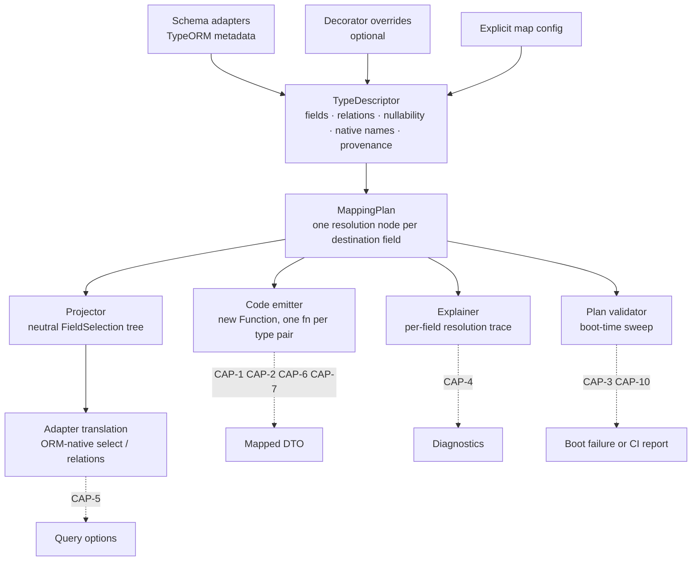
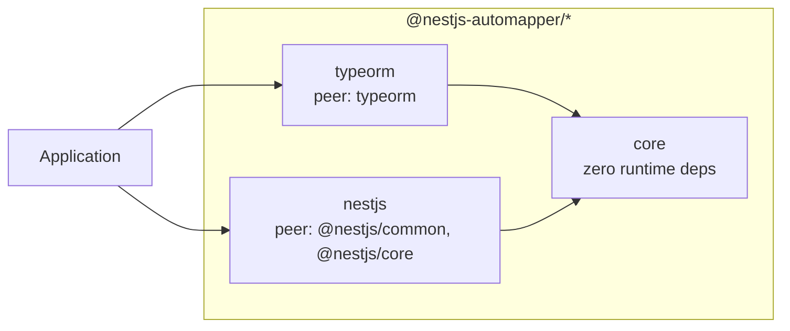

# Architecture diagrams

Companion to `SPEC.md`. Structural shape only; the decisions these illustrate are recorded in the kernel's Constraints and in `.memlog.md`.

## Pipeline spine

Metadata converges into one intermediate representation, and every consumer reads that IR rather than re-deriving from source. This is what keeps mapping, projection, and diagnostics from disagreeing about what a mapping does.

`core` computes the neutral `FieldSelection` tree only. Translation into ORM-native shapes happens in the adapter package, which is what keeps the zero-dependency constraint on `core` enforceable.

## Package boundaries

Adapter packages depend on `core`; `core` depends on nothing. An adapter never imports another adapter. Packages deferred to 2.1 and later — Prisma, Mongoose, Drizzle — attach at the same boundary as `typeorm`, which is the test of whether the adapter interface is genuinely decoupled.

## Where a mapping can fail

Failure moves as far left as the available information allows. This is the structural expression of the "prefer a compile error over a runtime throw" constraint.

The incumbent's failures land in the two right-hand states. Every capability in this spec that looks like a developer-experience nicety is in fact a mechanism for moving a failure leftward.
